# Dart Programming Language

Dart is a client-optimized language for developing fast apps on any platform. Its goal is to offer the most productive programming language for multi-platform development, paired with a flexible execution runtime platform for app frameworks.

#

## What is Dart ?


A 'player' can throw this "dart arrow" to the 'dart board' during 'dart game'. We think of the dart arrow as being the Dart language, the dart player as the Dart Developer, and the dart board as being the entire eco-system of the dart based apps.

### Dart Arrow:

- `Precision -` Language has to be as optimised as possible.

- `Speed -` Language has to be minimalist and fast to run.

- `Tough -` Language has to be scalable, maintainable and readable.

- `Modifiable -` Language has to benifit of fast hot reload.

- `Popular Framework -` Language is the foundation of Flutter.

These are the core features of Dart programming language.
Str

#

## Type Safe Language :

Dart is a Type Safe Language, the only operations that can performed on data in the language, are those allowed by type of the data. For example if we've an variable `int x` is not allowed to perform the `String Operations` like `toUpperCase() or toLowerCase()`, since the `String` types doesn't support `integer operations`.

#

## Sound Type System :

The Sound type system won't allow the code to run into undefined states, but exactly it is called as `SOUND`.
The Dart having the both `Static Type Check` and `Runtime Check`. These are mainly used to find the error in the code or error in the time of compilation.

#

## Dynamic Type :

Whenever we use `dynamic`type the static analyzer won't care about that data anymore.

#

## Type inference :

Types are Mandatory but don't have to be annotated, because dart can INFER TYPES by using the `var` keyword. When we assign a value to an variable with `var` keyword, it automatically assign the type also.

#

## Var vs Dynamic :

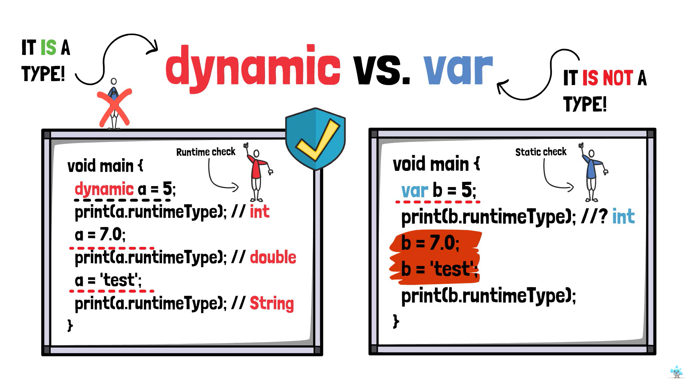

#

## Sound Null Safety :

Variables can't contain `NULL`, unless you say they can. If the dart variable is NON-NULLABLE that variable will always be NON-NULLABLE. NON-NULLABILITY is retained at RUNTIME!. Null Safety is really important in dart programmin

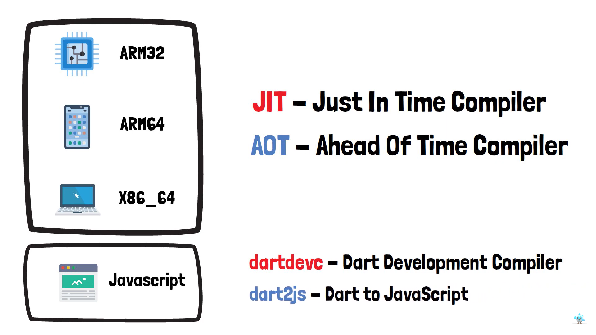

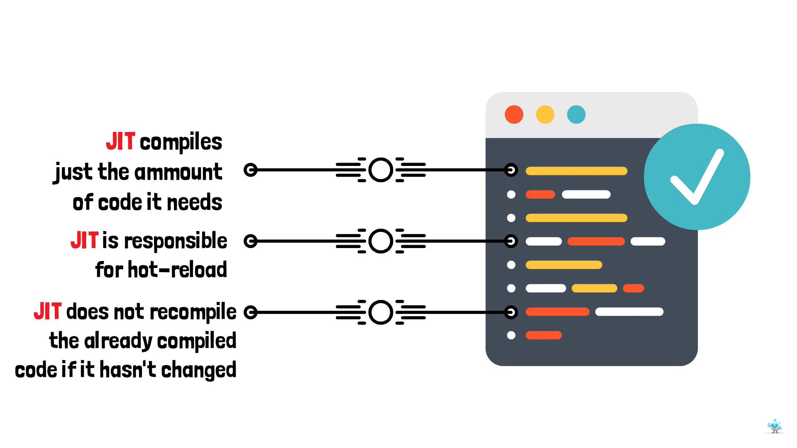

#

## Dart SDK :

The Dart SDK has the libraries and command-line tools that you need to develop Dart web, command-line, and server apps. To get the Dart SDK, see Get Dart. If you're developing Flutter apps, then you don't need to separately download the Dart SDK; just install Flutter.

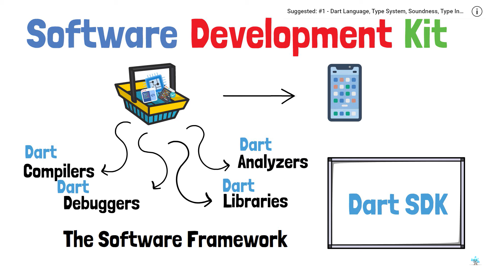

#

## Installation

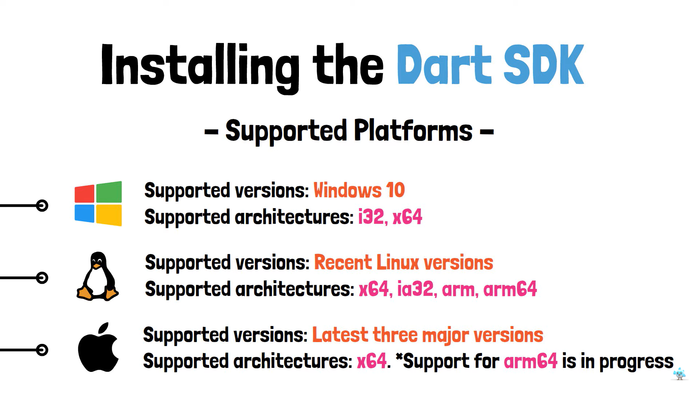

To Install Dart - https://medium.com/yavar/dart-bc897f1df1dd

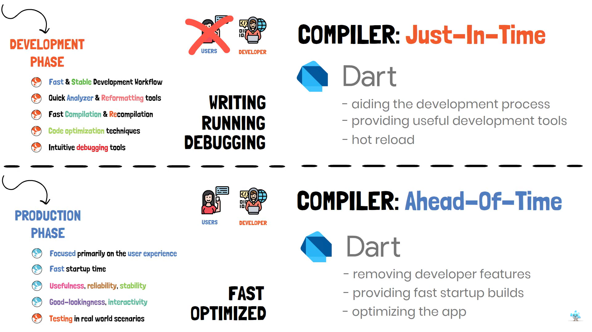

#

## To Create Dart console template :

```Dart
dart create -t console-full console_full-project
```

```Dart
cd console_full-project
```

```Dart
dart run
```

The Dart compile will compiler the dart file, which is inside the bin folder.

## Installing Devtols :

1. Run the command :

```Dart
dart pub global activate devtools
```

2. Add the file path in Environment variables.

3. Then run the command :

```Dart
dart run --observe --pause-isolates-on-start
```

4. Open a new terminal and run the command given below, once you run the command the `devtools` will open on your browser.

```Dart
devtools
```

5. Copy the VM service is listening on [...url...] and paste it on the `devtools`.

6. Connect the url to the `devtools`.

   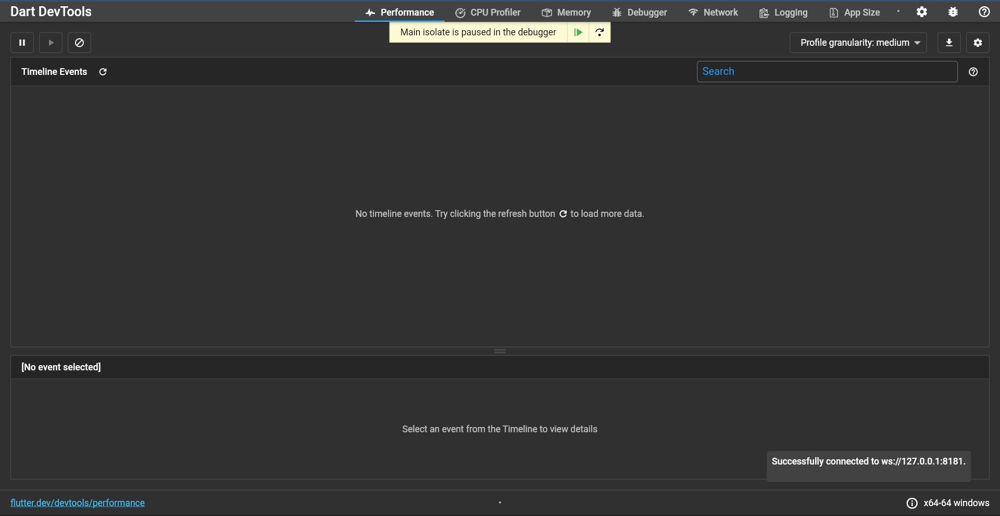

## Exploring dart project files and packages :


## Dart Package :

The dart package is the main component of dart ecosystem, there is a place, where all dart developer were publish their dart packages called `pub.dev`.

The main use of packages is to '**Retrieve data from an API**', '**Parse the JSON inside the APP**', and '**Store the data to a local Database**'.

We can also use already existing packages, each packages have an different features.

### http Package :

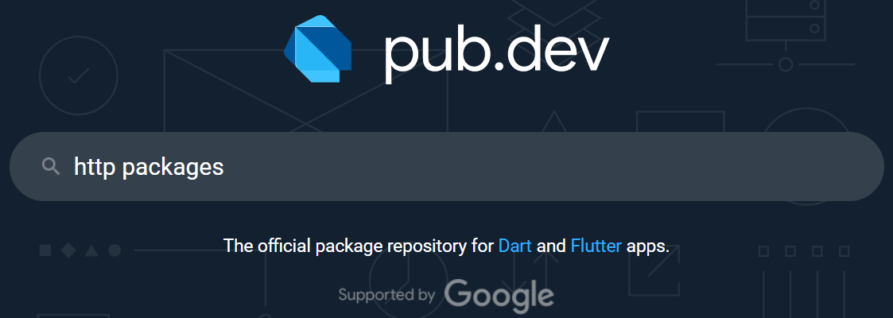

A composable, Future-based library for making HTTP requests.It mainly used to retrieve data from an API by using this package.

### json_serializable package :

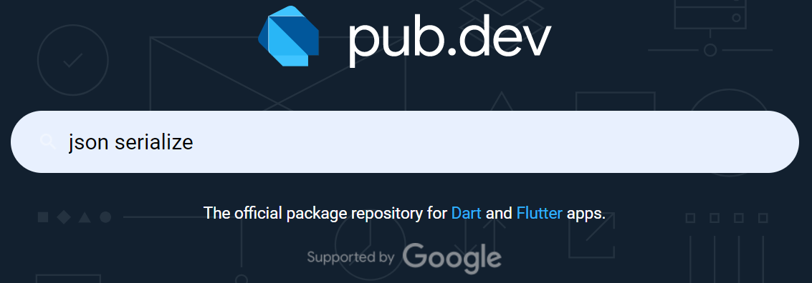

It Provides Dart Build System builders for handling JSON. It is mainly used to Parse the JSON inside the APP.

### hive package :


Hive is a lightweight and blazing fast key-value database written in pure Dart. It is mainly used to store the data to a local Database.

## Dart VM can Execute Dart apps in 2 ways :

1. From Source by using JIT/AOT Compiler
2. From Snapshots(jit, aot or kernal snapshots).

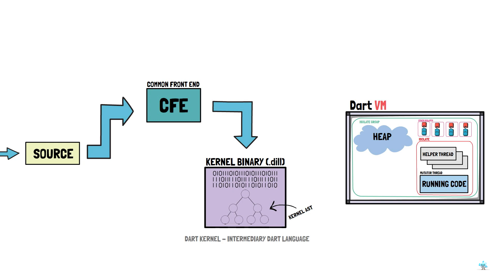

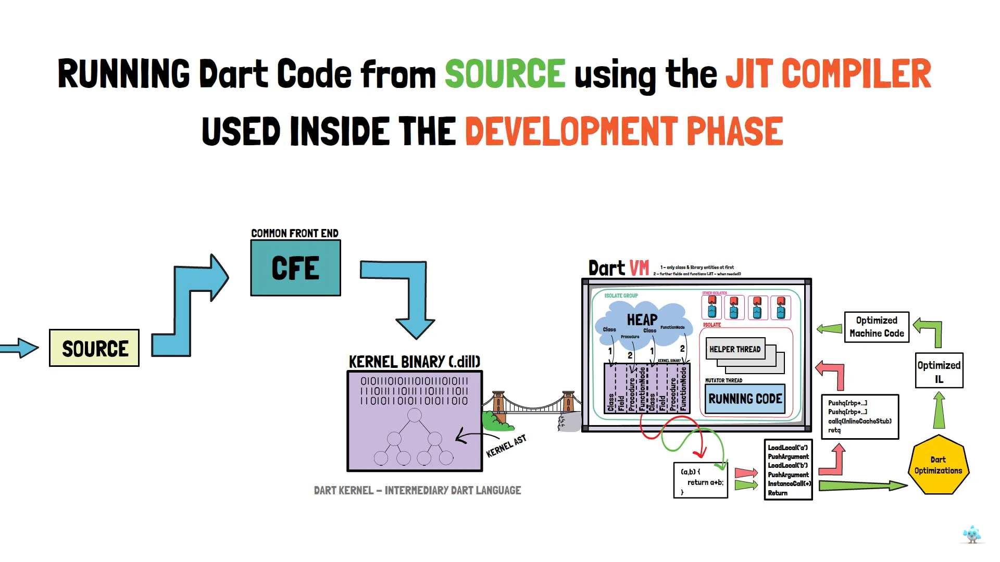

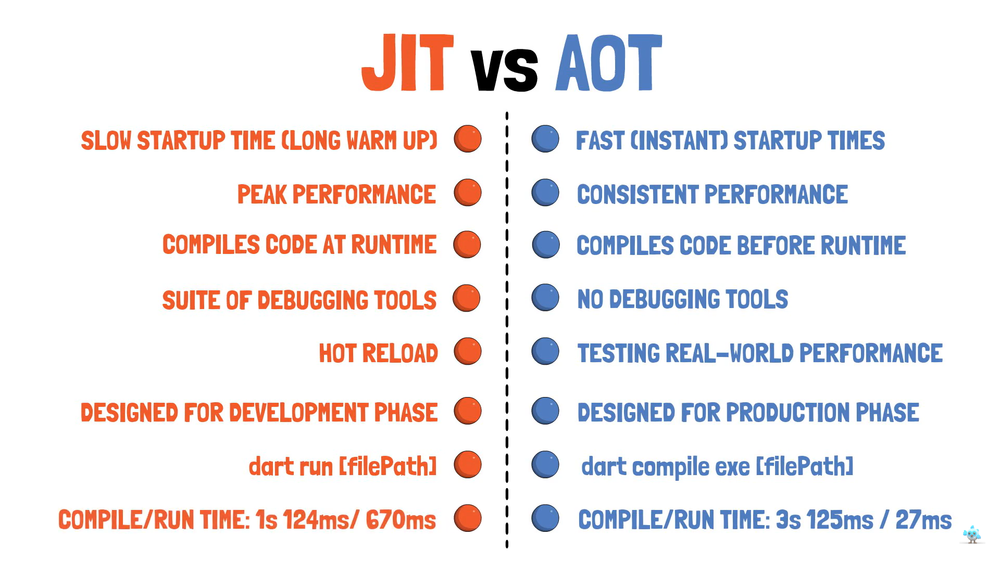

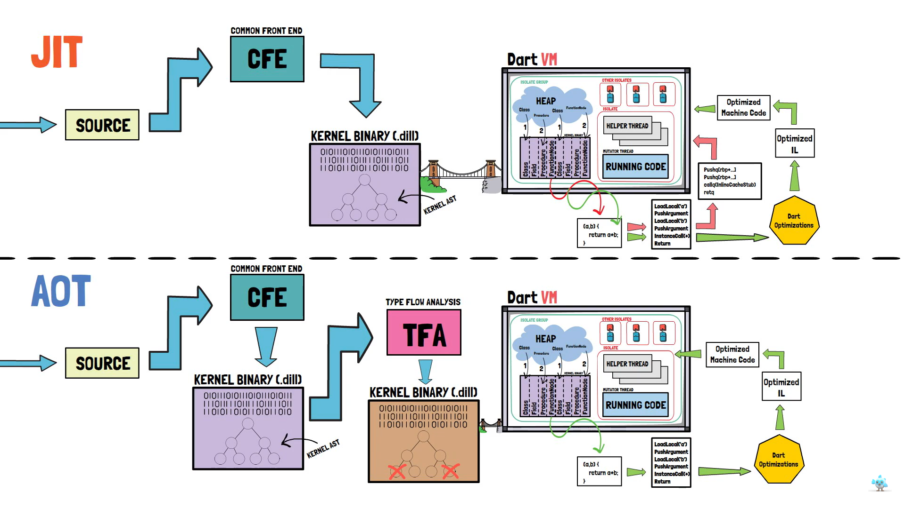
