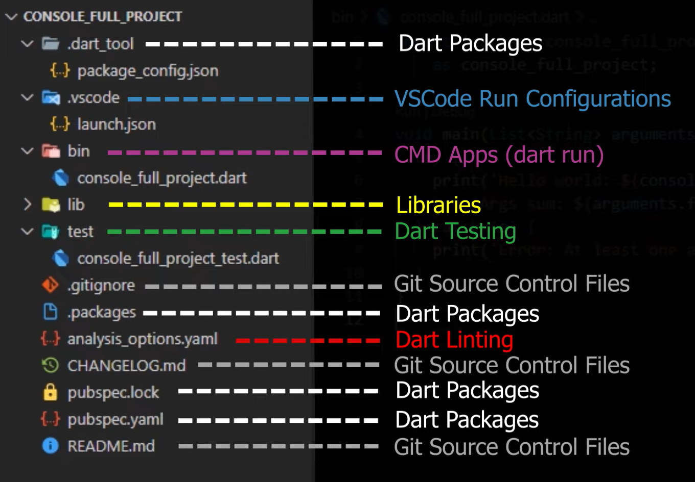

# App Development


Application development is the process of creating a computer program or a set of programs to perform the different tasks that a business requires. From calculating monthly expenses to scheduling sales reports, applications help businesses automate processes and increase efficiency.

# Mobile App Development


Mobile application development is the process of creating software applications that run on a mobile device, and a typical mobile application utilizes a network connection to work with remote computing resources.

#

## Types of App Development :

1. Native Application Development.
2. Web based Application Development.
3. Hybrid Application Development.

#

## Native Application Development :


Native Application are designed to run an particular platform such as Andriod, Windows or ios.

#

## Web based Application Development :


Web based applications are written in HTML, CSS, JAVASCRIPT. To use this application you’ll need internet connection.

#

## Hybrid App Development :


Hybrid application is a combination of both Native and Web-based Applications.

#


# Dart Programming Language

Dart is a client-optimized language for developing fast apps on any platform. Its goal is to offer the most productive programming language for multi-platform development, paired with a flexible execution runtime platform for app frameworks.

#

## What is Dart ?


A 'player' can throw this "dart arrow" to the 'dart board' during 'dart game'. We think of the dart arrow as being the Dart language, the dart player as the Dart Developer, and the dart board as being the entire eco-system of the dart based apps.

### Dart Arrow:

- `Precision -` Language has to be as optimised as possible.

- `Speed -` Language has to be minimalist and fast to run.

- `Tough -` Language has to be scalable, maintainable and readable.

- `Modifiable -` Language has to benifit of fast hot reload.

- `Popular Framework -` Language is the foundation of Flutter.

These are the core features of Dart programming language.
Str

#

## Dart SDK :

The Dart SDK has the libraries and command-line tools that you need to develop Dart web, command-line, and server apps. To get the Dart SDK, see Get Dart. If you're developing Flutter apps, then you don't need to separately download the Dart SDK; just install Flutter.


#

## Installation


To Install Dart - https://medium.com/yavar/dart-bc897f1df1dd


#

## To Create Dart console template :

```Dart
dart create -t console-full console_full-project
```

```Dart
cd console_full-project
```

```Dart
dart run
```

The Dart compile will compiler the dart file, which is inside the bin folder.

#

## Installing Devtols :

1. Run the command :

```Dart
dart pub global activate devtools
```

2. Add the file path in Environment variables.

3. Then run the command :

```Dart
dart run --observe --pause-isolates-on-start
```

4. Open a new terminal and run the command given below, once you run the command the `devtools` will open on your browser.

```Dart
devtools
```

5. Copy the VM service is listening on [...url...] and paste it on the `devtools`.

6. Connect the url to the `devtools`.

   

#

## Type Safe Language :

Dart is a Type Safe Language, the only operations that can performed on data in the language, are those allowed by type of the data. For example if we've an variable `int x` is not allowed to perform the `String Operations` like `toUpperCase() or toLowerCase()`, since the `String` types doesn't support `integer operations`.

#

## Sound Type System :

- The Sound type system won't allow the code to run into undefined states, but exactly it is called as `SOUND`.

- The Dart having the both `Static Type Check` and `Runtime Check`. These are mainly used to find the error in the code or error in the time of compilation.

#

## Dynamic Type :

Whenever we use `dynamic`type the static analyzer won't care about that data anymore.

#

## Type inference :

Types are Mandatory but don't have to be annotated, because dart can INFER TYPES by using the `var` keyword. When we assign a value to an variable with `var` keyword, it automatically assign the type also.

#

## Var vs Dynamic :


#

## Sound Null Safety :

Variables can't contain `NULL`, unless you say they can. If the dart variable is NON-NULLABLE that variable will always be NON-NULLABLE. NON-NULLABILITY is retained at RUNTIME!. Null Safety is really important in dart programmin

#

## Dart compiler :

The Dart Compiler is a compiler which is a tool that converts the source code you wrote in dart language into other intermediate languages or machine code that ca n run on a specific platform in dart virtual machine. However dart uses different compilers for different jobs.


During the project there should be two phases :

1. Development Phase.

2. Production Phase.

#


#

## JIT Compiler :

- JIT, which stands for Just In Time Compiler. Just In Time Compiler as its name is implying compiles just the amount of code it needs.

- For example : If our project having 10,000 lines of code, it won't compile enitire code, it only compile the required set of code.

- JIT also comes with an incremental recompilation.

- Jit does not transform the dart code into machine code, but rather into an intermediatary language (For Faster Development Cycles).

- The JIT was mainly designed for Development Phase.

#

## AOT Compiler:

- AOT, Which stands for Ahead of Time Compiler.

- The Ahead of Time Compiler, compiles entire source code into a machine code supported natively by the platform.

- The AOT compiler is mainly designed for Production Phase.

#

## Exploring dart project files and packages :



#

## Dart Package :

- The dart package is the main component of dart ecosystem, there is a place, where all dart developer were publish their dart packages called `pub.dev`.

- The main use of packages is to '**Retrieve data from an API**', '**Parse the JSON inside the APP**', and '**Store the data to a local Database**'.

- We can also use already existing packages, each packages have an different features.

- Our dart project is a standalone dart package.

#

### http Package :


A composable, Future-based library for making HTTP requests.It mainly used to retrieve data from an API by using this package.

#

### json_serializable package :


It Provides Dart Build System builders for handling JSON. It is mainly used to Parse the JSON inside the APP.

#

### hive package :


Hive is a lightweight and blazing fast key-value database written in pure Dart. It is mainly used to store the data to a local Database.

#

## Application and Library package :

The Package that won't be uploaded in the `pub.dev` is known as `Application package` and the package that will be uploaded into `pub.dev` is known as `Library package`.

#

## Package and Library :

- The Relationship between package and library is that the package can contain one or multiple libraries.

- The Libraries are the only part that is publicaly accessible to everyone.

#

## Dart Linting :

The Dart Linter package defines lint rules that identify and report on `lints` found in Dart code. Linting is performed by the Dart analysis server and the dart analyze command in the Dart command-line tool.

#

## Dart Tests :

- The Dart Tests represents the one of the pillars that add a lot of value onto the development and maintaince aspects of a project

- They are the pieces of code that we write in order to make sure the features and implementatoions

- We coded behave and output things as expected ideally for every features or added functionallity we should test checking if it's working good or not in dart test are written inside the test folder in files appending underscore.test at the end in pour case, we have a test verifying if the putput of the caculate function is really expected number of 42.

- This is called a unit test adn the simplest test we can write but how do we run it as you have probably guessed by now you can do it from inside the editor or from inside the dart cli.

- Inside the editor we actually have a dedicated panel we can go to called testing at the top we have multiple button to run the tests.

- Inside the `dart cli` run a command `dart test` to run full tests.

#

# Dart Application in Depth :


## How does Dart run a program ?

### Dart VM :

A Dart VM is a Virtual machine in a sense that it provides an execution environment for our Dart Programming Language.

The Dart Apps, Programs, and Packages are run inside the Dart VM

- The RUNTIME System.
- Development Experience Components.
  - Debugging.
  - Hot Reload.
- JIT & AOT Compilation Pipelines.


#

## Heap :

- The Heap is the Garbage Collection managed memory storage for akk the objects allocated by the code running in the specific isolate, the garbage collector attemps to reclaim memory which was allocated by the program but it no longer referenced.

- Each isolate has single mutator thread which executes but benifits from multiple helper threads which handle VM's internal tasks.

### Dart VM can Execute Dart apps in 2 ways :

1. From Source by using JIT/AOT Compiler
2. From Snapshots(jit, aot or kernal snapshots).

#

## What happen when we running a source using JIt Compile or Typing `dart run` command:

- The Dart VM doesn't have the ability to execute raw dart code, instead it expects some kernal binares also called dill files which contains serialized kernal abstract syntax tree as known as kernal ast. The kernal ast is actually based on this intermediatary language

- The Dart Kernal is a small high-level intermediary language derived from dart Language.

- The Task of translating dart souce code into kernal ast is handled by a dart package called the Common Frontend or CFE.

- The process of the aot compilation does global static analysis called `Type Flow Analysis` or alos called `TFA`.


#

## Running the Dart code from a Snapshot :

### Snapshots :

A Dart snapshot is just a binary serialization of the token stream, generated from parsing the code. A snapshot is not a "snapshot of a running program", it's generated before the tokens are turned into machine code. So, no program state is captured in a snapshot.

A Dart Snapshots contains an efficient representation of all those entities allocated on the dart `VM Heap`.

Entities which are need to start an execution process.

Currently there are three snapshot types :

1.  JIT - Snapshot.

2.  AOT - Snapshot.

3.  Kernal - Snapshot.
